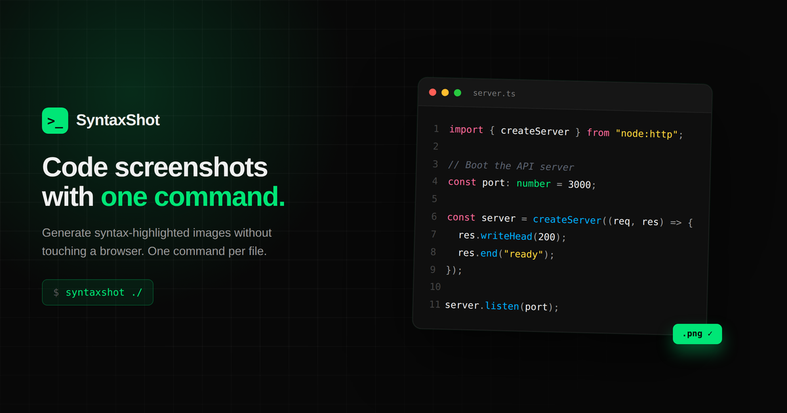

<div align="center">

# SyntaxShot 



**[SyntaxShot](https://github.com/luis0antonio55/syntaxshot)** — A CLI tool that generates beautiful syntax-highlighted code screenshots from your terminal.

[](https://vitejs.dev/)
[](https://react.dev/)
[](https://www.typescriptlang.org/)

[View Live Site](https://syntaxshot-page.vercel.app/) · [Report Bug](https://github.com/luis0antonio55/syntaxshot/issues) · [Request Feature](https://github.com/luis0antonio55/syntaxshot/issues)

</div>

---

## 🚀 About

This repository contains the complete product landing website for **SyntaxShot**, featuring:

- 🎯 **Landing Page** — Hero section, features, pricing, and CTA
- 📚 **Documentation** — Installation guides and usage examples
- 🎨 **Theme Gallery** — Interactive theme preview with 8 built-in themes
- 🛠️ **Reusable Components** — Full shadcn/ui component library

Built with modern web technologies for performance and developer experience.

---

## 📋 Prerequisites

- **Node.js** 18+ (recommended)
- **npm** or **pnpm** package manager

---

## ⚡ Quick Start

### 1. Clone the repository

```bash
git clone https://github.com/luis0antonio55/syntaxshot.git
cd syntaxshot
```

### 2. Install dependencies

```bash
npm install
# or
pnpm install
```

### 3. Start development server

```bash
npm run dev
# or
pnpm dev
```

The site will be available at `http://localhost:5173`

### 4. Build for production

```bash
npm run build
# or
pnpm build
```

---

## 📁 Project Structure

```
syntaxshot/
├── src/
│   ├── app/
│   │   ├── pages/
│   │   │   ├── Landing.tsx      # Main landing page
│   │   │   ├── Docs.tsx         # Documentation page
│   │   │   └── Support.tsx      # Support page
│   │   ├── components/
│   │   │   └── ui/              # shadcn/ui components
│   │   ├── hooks/
│   │   │   └── useSeo.ts        # SEO hook
│   │   └── routes.ts            # Route configuration
│   ├── styles/
│   │   ├── globals.css          # Global styles
│   │   ├── theme.css            # Theme variables
│   │   └── fonts.css            # Font imports
│   └── main.tsx                 # App entry point
├── public/
│   ├── favicon/                 # Favicon assets
│   ├── og-image.png             # Social preview image
│   └── robots.txt               # SEO configuration
├── api/
│   └── support.ts               # Support form API
└── package.json
```

---

## 🎨 Tech Stack

| Category          | Technology                 |
| ----------------- | -------------------------- |
| **Framework**     | React 18.3 with TypeScript |
| **Build Tool**    | Vite 6.x                   |
| **Styling**       | Tailwind CSS 4.x           |
| **UI Components** | shadcn/ui (Radix UI)       |
| **Routing**       | React Router v7            |
| **Icons**         | Lucide React               |
| **Animations**    | Motion (Framer Motion)     |
| **Deployment**    | Vercel                     |

---

## 🛠️ Available Scripts

| Command           | Description                      |
| ----------------- | -------------------------------- |
| `npm run dev`     | Start development server         |
| `npm run build`   | Build for production             |
| `npm run preview` | Preview production build locally |

---

## 🌐 Deployment

This site is deployed on **Vercel** with automatic deployments from the main branch.

The `vercel.json` configuration handles SPA routing:

```json
{
  "rewrites": [
    {
      "source": "/((?!api/).*)",
      "destination": "/index.html"
    }
  ]
}
```

---

## 🎯 Key Features

### Interactive Theme Gallery

- Drag-to-scroll theme carousel
- Live theme preview with real syntax highlighting
- CLI command examples for each theme

### Responsive Design

- Mobile-first approach
- Adaptive navigation and layouts
- Optimized for all screen sizes

### Performance Optimized

- Vite for lightning-fast HMR
- Lazy loading and code splitting
- Optimized assets and fonts

### SEO Ready

- Dynamic meta tags with `useSeo` hook
- Open Graph and Twitter Card support
- Sitemap and robots.txt configured

---


## 🔗 Links

- **Main CLI Tool**: [https://github.com/luis0antonio55/syntaxshot](https://github.com/luis0antonio55/syntaxshot)
- **Live Website**: [https://syntaxshot-page.vercel.app/](https://syntaxshot.vercel.app)
- **Documentation**: [https://syntaxshot-page.vercel.app/docs](https://syntaxshot.vercel.app/docs)

---


